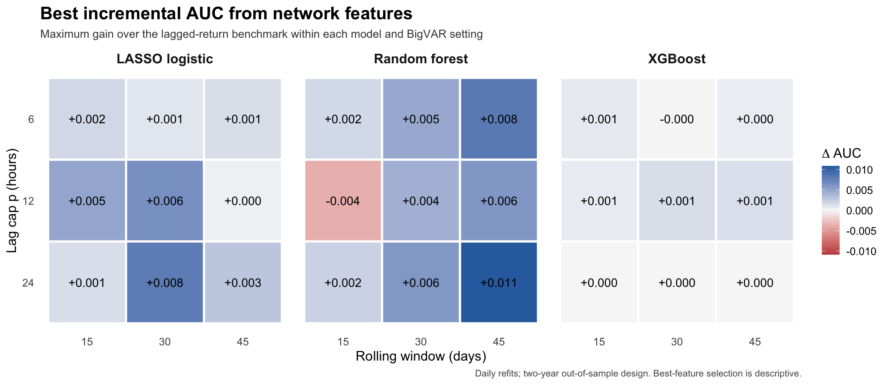
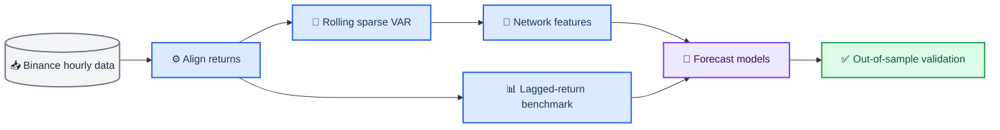

# Dynamic Crypto Network Forecasting

_A reproducible financial time-series project testing whether sparse cross-asset network signals improve next-hour cryptocurrency return-direction forecasts._

This repository contains the code and selected results from my master's thesis. It combines rolling sparse VAR estimation, network features, and out-of-sample classification. The main result is shown below, a small demo can be run locally, and the full pipeline code is included.

---

## 📋 Project overview

**Research question:** Do network features extracted from sparse VAR models add forecasting information beyond conventional lagged-return predictors?

| Dimension | Design |
| --- | --- |
| Market | 12 major Binance spot cryptocurrencies |
| Frequency | Hourly returns |
| Empirical sample | April 2024–March 2026 |
| Network model | Rolling BigVAR with `HLAGELEM` regularization |
| Forecast target | Next-hour return direction |
| Classifiers | LASSO logistic, random forest, XGBoost |
| Validation | Chronological out-of-sample split and block-bootstrap uncertainty |


_Figure 1: Best network-feature AUC gain over the lagged-return benchmark within each classifier and sparse VAR setting._

The results are mixed: network features help in some settings, but the gains are small and are not consistent across models. The project therefore focuses on careful evaluation rather than claiming a strong forecasting signal.

## 🎯 What this project demonstrates

- Builds an aligned multi-asset panel from public hourly market data
- Estimates rolling sparse VAR models across multiple settings
- Converts coefficients into transmitter, receiver, and pair-signal features
- Keeps future data out of feature construction and model training
- Compares each augmented model with the same lagged-return benchmark
- Checks uncertainty with a moving-block bootstrap
- Includes a small local demo and a separate full experiment

## ⚙️ Analytical workflow



BigVAR is used as a network-feature generator rather than the final classifier. The `HLAGELEM` penalty supports pair-specific effective lag depths while retaining an interpretable hierarchical lag structure.[^1][^2]

See [methodology](docs/methodology.md) for feature definitions and evaluation details.

## 📊 Key findings

The primary configuration uses `p = 12`, a `30`-day rolling window, and daily network refits.

| Classifier | Lagged-return AUC | Best network AUC | ΔAUC | Best network feature set |
| --- | ---: | ---: | ---: | --- |
| LASSO logistic | 0.513 | 0.520 | +0.006 | Asset-specific signals |
| Random forest | 0.518 | 0.523 | +0.004 | Pair signals |
| XGBoost | 0.517 | 0.519 | +0.001 | Asset-specific signals |

For the primary LASSO comparison, the moving-block bootstrap interval for the AUC gain is `[+0.001, +0.014]`. Random forest produces a favorable point estimate with pair signals, but its interval includes zero. Across the wider specification grid, improvements remain uneven.

The XGBoost result is not treated as a failed model. The network is usually very sparse, so the added variables often provide too little new information for a tree split. A separate validation-based check reaches the same broad conclusion: pair signals add about `0.002` AUC, while the other network sets are flat or negative.

The network itself is sparse and time-varying: cross-asset coefficients appear on `73.7%` of primary-setting refit dates, while the median refit contains only four nonzero cross coefficients.

The [results guide](docs/results.md) explains the model differences and the included [summary metrics](results/primary_forecast_metrics.csv) provide the underlying values.

## 🚀 Quick start

### Prerequisites

| Requirement | Recommended | Purpose |
| --- | --- | --- |
| Python | 3.10+ | Data download and preparation |
| R | 4.3+ | Network estimation and forecasting |
| Memory | 8 GB+ for demo | Local execution |

Install the R dependencies:

```bash
Rscript scripts/install_required_packages.R
```

Run code and sample-data checks:

```bash
make check
```

Run the compact end-to-end demonstration:

```bash
make demo
```

The demo uses the bundled 35-day sample and fits two rolling sparse VARs with the primary lag cap. It produces a small set of selected cross-asset edges and validates the workflow without reproducing the full two-year experiment. The verified local run completed in about 80 seconds; runtime varies by machine.

## 📦 Repository structure

```text
crypto-network-forecasting/
├── README.md
├── Makefile
├── data/
│   ├── README.md
│   └── sample/                 # Small committed demo inputs
├── scripts/
│   ├── R/                      # Core network and forecasting functions
│   ├── download_binance_hourly_data.py
│   ├── prepare_crypto_hourly_dataset.py
│   ├── run_demo.R
│   ├── run_full_primary.sh
│   ├── run_xgboost_diagnostic.R
│   └── create_portfolio_figures.R
├── results/
│   ├── figures/                # Curated portfolio figures
│   └── *.csv                   # Compact result summaries
├── docs/
│   ├── methodology.md
│   ├── results.md
│   └── reproducibility.md
└── tests/
    └── test_data_contract.R
```

Generated raw data, intermediate coefficient tables, prediction panels, logs, and local package libraries are excluded from version control.

## 🔄 Full reproduction

Download and prepare the archived market data:[^3]

```bash
python3 scripts/download_binance_hourly_data.py
python3 scripts/prepare_crypto_hourly_dataset.py
```

Run the full primary setting:

```bash
bash scripts/run_full_primary.sh
```

The full primary experiment contains `700` daily refits and is intentionally split into recoverable blocks. Recorded 25-origin blocks took roughly 20–25 minutes in the original environment; a sequential full run can take approximately 9–12 hours. Parallel block execution reduces wall time substantially. See the [reproducibility guide](docs/reproducibility.md) for compute expectations and checkpoints.

## ⚠️ Scope and limitations

- Results measure predictive association, not causal spillovers
- AUC gains are small and vary across models, assets, and sparse VAR settings
- XGBoost uses a conservative specification rather than a large hyperparameter search
- The analysis does not include transaction costs, portfolio construction, or live execution
- Binance is the sole exchange and USDT is the sole quote currency
- Best-feature heatmap cells are descriptive maxima, not independently validated model choices
- Full replication is computationally heavier than the included demo

This repository therefore presents a forecasting and market-structure research pipeline, not a deployable trading strategy.

## 🔗 References

[^1]: Nicholson, W. B., Matteson, D. S., and Bien, J. (2017). "VARX-L: Structured regularization for large vector autoregressions with exogenous variables." _International Journal of Forecasting_. https://doi.org/10.1016/j.ijforecast.2017.01.003

[^2]: Nicholson, W. B., Wilms, I., Bien, J., and Matteson, D. S. (2020). "High dimensional forecasting via interpretable vector autoregression." _Journal of Machine Learning Research_. https://jmlr.org/papers/v21/19-777.html

[^3]: Binance. "Binance Public Data." https://github.com/binance/binance-public-data

---

© 2026 Shaoxuan Shi. All rights reserved. See [LICENSE](LICENSE) for permitted use.
