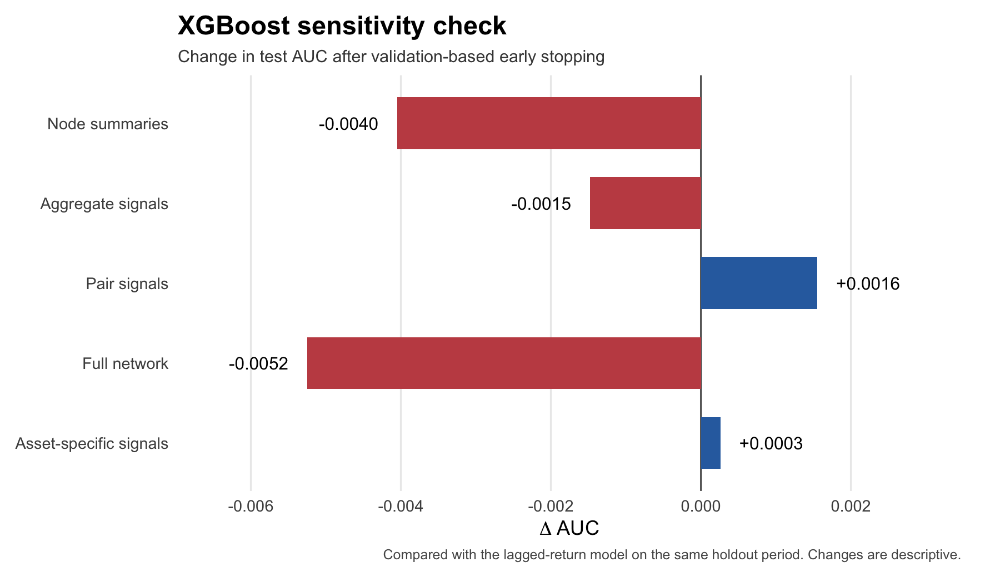
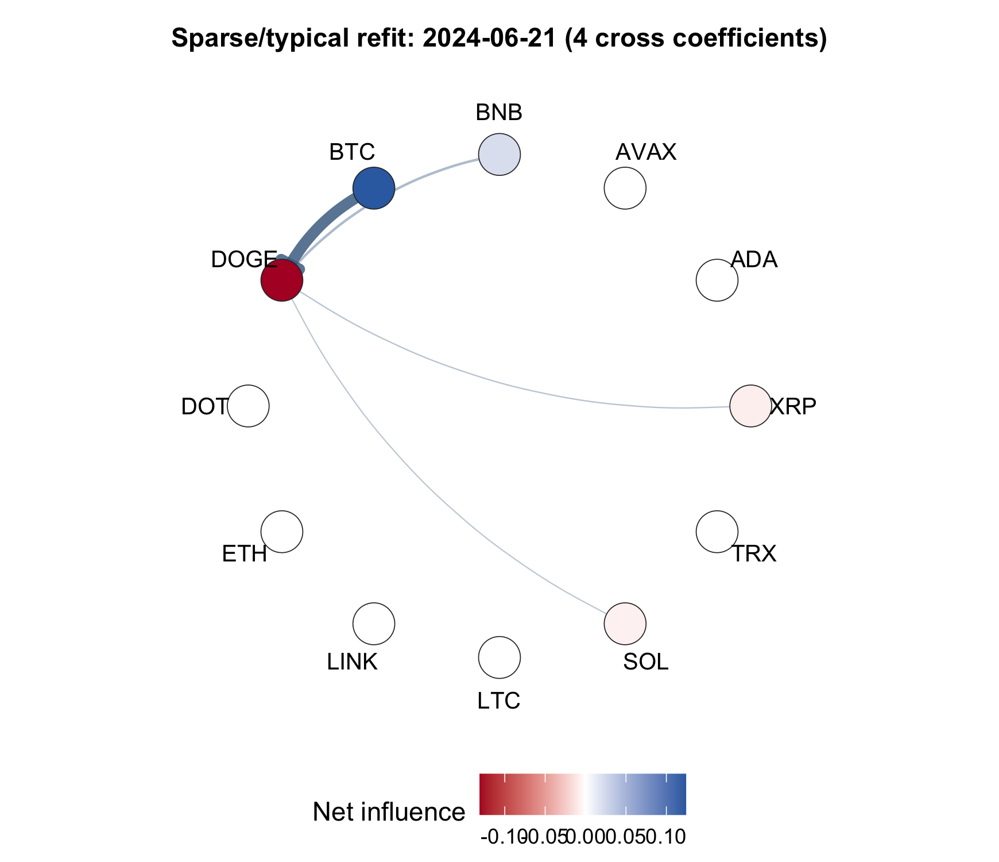

# Results guide

_How to read the forecasting results, model differences, and network diagnostics_

---

## 📋 Primary result

The primary setting uses `HLAGELEM`, `p = 12`, a `30`-day rolling window, and daily refitting. Each model-feature comparison is evaluated on `60,480` asset-hour observations from the final 30% of the sample.

| Classifier | Selected feature set | ΔAUC | AUC interval | Δ balanced accuracy |
| --- | --- | ---: | ---: | ---: |
| LASSO logistic | Asset-specific signals | +0.006 | `[+0.001, +0.014]` | +0.003 |
| Random forest | Pair signals | +0.004 | `[-0.005, +0.013]` | +0.007 |
| XGBoost | Asset-specific signals | +0.001 | Not computed | -0.001 |

The LASSO AUC interval is `[+0.001, +0.014]`, so this is the clearest positive result. The random-forest point estimate is larger on balanced accuracy, but its uncertainty interval includes zero. XGBoost changes very little. Taken together, the models support a narrow conclusion: network features sometimes help, but the gain is small and depends on the model and feature design.

## 🔍 Why the models react differently

The network signals are weak and intermittent. At least one cross-asset coefficient appears on `73.7%` of refit dates, but the median network contains only four nonzero cross coefficients. In simple terms, the network often exists, but there is usually very little of it.

The three classifiers use that information differently:

- **LASSO logistic** can combine several small, roughly linear contributions into one score
- **Random forest** may use a network variable in some trees, but the observed gain is not stable under the bootstrap check
- **XGBoost** adds a split only when it reduces the loss enough; most network variables do not clear that threshold consistently

This is an interpretation of the model behavior, not proof that one learning algorithm is generally better. The random-forest and XGBoost results mainly show that the extra variables do not provide a strong, repeatable nonlinear advantage.

## 📊 XGBoost sensitivity check

The main comparison uses one deliberately conservative XGBoost specification. The follow-up check keeps the same holdout period but reserves the last 20% of the training period for validation. It allows up to `300` rounds, stops after `20` rounds without improvement, and uses row and column sampling.

_Figure 1: Test AUC change relative to the lagged-return XGBoost model. The changes are descriptive rather than new significance tests._

| Added feature set | Δ test AUC | Best iteration | Network gain share |
| --- | ---: | ---: | ---: |
| Node summaries | -0.0040 | 7 | 0.08% |
| Aggregate signals | -0.0015 | 12 | 0.06% |
| Pair signals | +0.0016 | 14 | 0.00% |
| Full network | -0.0052 | 6 | 0.22% |
| Asset-specific signals | +0.0003 | 15 | 0.10% |

Network gain share is the share of total XGBoost split gain assigned to network variables. It stays below `0.22%` in every specification, and the model stops after only a small number of rounds. Pair signals show a small positive AUC change even though none is selected for a split. Because this diagnostic uses row and column sampling, adding columns can change the fitted trees even when the added variables are not used. The `+0.0016` change is therefore too small to treat as evidence that XGBoost found a useful network signal.

The full values are in [`xgboost_diagnostic_summary.csv`](../results/xgboost_diagnostic_summary.csv). The script [`run_xgboost_diagnostic.R`](../scripts/run_xgboost_diagnostic.R) reproduces the check after the full prediction panel has been generated.

## 📈 Robustness grid

_Figure 2: Best network-feature AUC gain over the lagged-return benchmark for each classifier and sparse VAR setting._

LASSO logistic and random forest improve in selected settings, while XGBoost remains close to its benchmark throughout the grid. The largest cell is `+0.011`, but average gains are close to zero. The heatmap shows the best feature set within each cell, so it is a descriptive summary rather than a separate model-selection test.

## 🔗 Network structure

The primary network is sparse and changes over time. At least one cross-asset coefficient is selected on `73.7%` of the `700` refit dates, but the median refit contains only four nonzero cross coefficients.

_Figure 3: Representative sparse refit; directed edges are selected cross-asset lag coefficients._

This pattern helps explain the forecast results. A network feature can be useful during some periods without adding much information across the full test sample.

## 📦 Included outputs

- `primary_forecast_metrics.csv` contains pooled model-feature metrics
- `primary_metrics_by_asset.csv` contains asset-level results
- `uncertainty_summary.csv` contains moving-block bootstrap comparisons
- `robustness_best_delta_auc.csv` supports the robustness heatmap
- `network_summary.csv` contains primary network diagnostics
- `xgboost_diagnostic_summary.csv` contains the validation-based sensitivity check

Large prediction panels and intermediate coefficient tables are excluded from version control.
